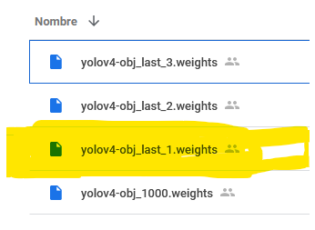
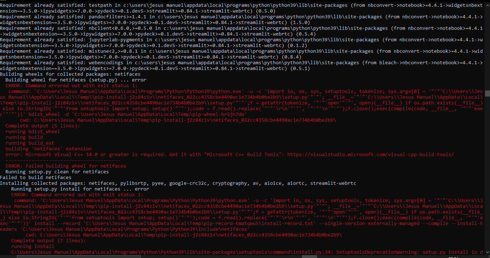

# Proyecto de Detección de Protocolos de Sana Distancia Utilizando YOLOv4
El proposito de este repositorio es almacenar el código utilizado para entrenar un modelo personalizado de YOLOv4 entrenado con un dataset que contiene fotos de personas con y sin cubrebocas, así como almacenar el código de la parte de Front-End del mismo.

## Paso 1: Entrenamiento del Modelo
Para entrenar este modelo, primero es necesario descargar el dataset de [Detección de cubrebocas](https://www.kaggle.com/andrewmvd/face-mask-detection) de Kaggle. Este archivo, llamado `archive.zip` se deberá colocar dentro del directorio `Proyecto Sana Distancia/Data/`.

Una vez realizado este proceso, es necesario subir la carpeta `Proyecto Sana Distancia` a la *raíz* de una unidad personal de [Google Drive](https://www.drive.google.com/). Este paso es fundamental debido a que la Notebook en Google Colab monta una unidad de Google Drive para poder extraer la información para entrenar el modelo.

Una vez realizados estos pasos, simplemente se deberá de correr la Notebook en su totalidad para poder entrenar el modelo. La Notebook contiene información más detallada acerca del proceso de entrenamiento y la exploración de los datos utilizados.

Al terminar el entrenamiento, para poder utilizar el modelo personalizado, es necesario descargar los *weights* y el archivo de configuración utilizados en el modelo. Se recomienda que para los pesos se utilice el archivo ya incluido en este repositorio llamado `yolov4-obj_last_1.weights` que se encuentra dentro de la carpeta de [backup](https://github.com/Tecnologias-Emergentes-Equipo2/Proyecto2/tree/main/Proyecto%20Sana%20Distancia/backup).



## Streamlit app

Streamlit es un framework para python que permite crear aplicaciones web de manera rápida sin la necesidad de especificar un backend/frontend. Todo se define a través de declaraciones en python. 

Para instalar y correr la aplicación crear un [venv](https://docs.python.org/3/tutorial/venv.html) e instalar las dependencias (requirements.txt) usando pip.

Estando dentro de este directorio. Para crear un ambiente virtual:

```
python -m venv venv
```

Para instalar las dependencias
```
pip install -r requirements.txt
```

Una vez instaladas, la aplicación se ejecuta:
```
streamlit run app.py
```

Algunos vídeos de prueba: 
 * https://www.youtube.com/watch?v=SkJ7oU9XIwY
 * https://www.youtube.com/watch?v=1jqY0Cm_c0I 

Funcionamiento de la app:


Visualización de ejecución funcional de personas con mascarilla, de forma correcta o incorrecta: 


## En caso presentar problemas de instalación:



-Verificar tener instalado la versión más actualizada de [Microsoft Visual C++ 14](https://visualstudio.microsoft.com/es/visual-cpp-build-tools/), de igual forma puedes consultar a detalle ese problema a través de esta [liga de apoyo](https://docs.microsoft.com/en-us/answers/questions/136595/error-microsoft-visual-c-140-or-greater-is-require.html)
